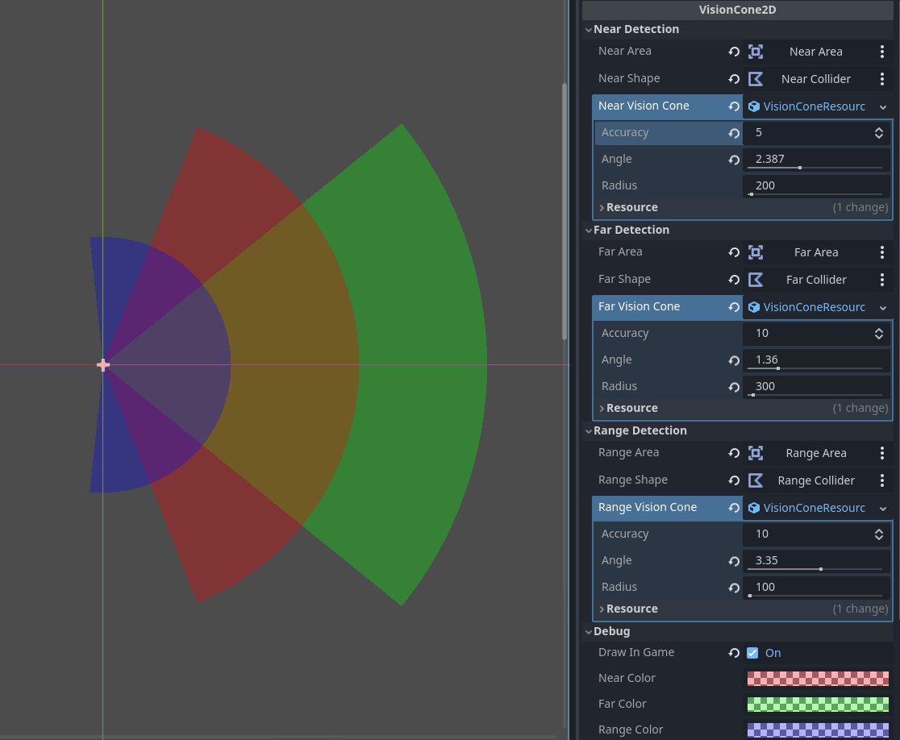
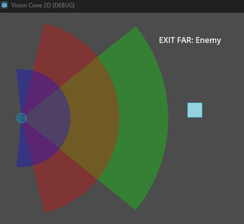
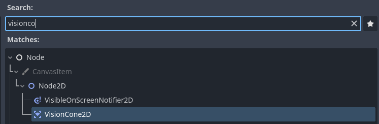

# godot-4-vision-cone-plugin
[](https://choosealicense.com/licenses/mit/)

Editor plugin to define character vision cones an its callbacks for different ranges.


## Controls


## Example
```cs
// detector.cs

[Export] public VisionCone2D visionArea;
[Export] Label label;

public override void _Ready(){
    base._Ready();

    visionArea.OnEnterFar   += (Node2D n) => label.Text = $"ENTER FAR: {n.Name}";
    visionArea.OnExitFar    += (Node2D n) => label.Text = $"EXIT FAR: {n.Name}";
    visionArea.OnEnterNear  += (Node2D n) => label.Text = $"ENTER NEAR: {n.Name}";
    visionArea.OnExitNear   += (Node2D n) => label.Text = $"EXIT NEAR: {n.Name}";
    visionArea.OnEnterRange += (Node2D n) => label.Text = $"ENTER RANGE: {n.Name}";
    visionArea.OnExitRange  += (Node2D n) => label.Text = $"EXIT RANGE: {n.Name}";
}
```


## API Reference

|Variable                       |Type                       |Description                                      |
|:---                           |:--------                  |:-------                                         |
|`OnEnter`                      |`event Action<Node2D>`     |Called whenever a node enters any region         |
|`OnExit`                       |`event Action<Node2D>`     |Called whenever a node exits any region          |
|`OnEnter<Range\|Near\|Far>`    |`event Action<Node2D>`     |Called whenever a node enters the given region   |
|`OnExit<Range\|Near\|Far>`     |`event Action<Node2D>`     |Called whenever a node exits the given region    |
|`<range\|near\|far>Nodes`      |`HashSet<Node2D>`          |List of nodes inside each region                 |

|Method            |Parameter       |Returns       |Description                                                                                |
|:---              |:--------       |:-------      |:-------------------------                                                                 |
|`IsInside`        |`body: Node2D`  |`bool`        |Returns true if the passed node is in sight                                                |
|`GetNodeInside`   |`T`             |`T`           |Returns the first node of type `T` in sight, checking in the order `Range -> Near -> Far`  |
|`Print`           |                |`string`      |Returns the list of all nodes in each region                                               |

## Usage
1. Copy the addons folder to the root of your project.
2. Build the project.
3. Go to `Project -> Project Settings -> Plugins` to enable the plugin.
4. Now you can add the vision cone node within Godot UI.

